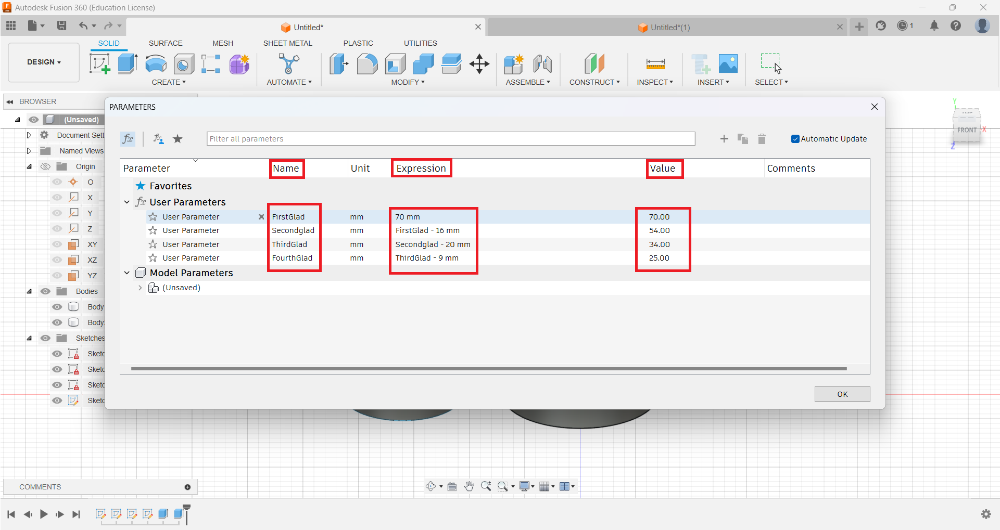

# Fusion 360 Design Project
## **Step 1: Build Design and New Component**

### **1.1 (Bench Vise Assembly)**

This assembly consisting of Four components, here are the components

1.  Base

2.  Vice Jaw

3.  Jaw Screw

4.  Screw Bar

First create a new design by going to file select new design.

Go to documents setting and change the units to millimeter.

### **1.2 Assemble Section (New Component)**

-   In assemble section create a new component and give it a name Base.

## **Step 2: Design 3D Model**

### **2.1 Solid (Create)**

-   In create section create a new sketch on the front plane with
    required dimensions.

-   After Create Sketch click on Finish Sketch and then Use Extrude
    Command

### **2.2 Construct Section (Tangent) & Modify (Fillet)**

-   We have used tangent tool to tangent the Circles which we created
    with circle tool in Create Section.

-   And we have used fillet feature which is present in Modify Section.

-   Now we use line command from create section and then after giving
    dimensions, we use vertical/horizontal tool from Constraints
    Section.

.png>)

.png>)

### **2.3 Inspect Section**

-   We use inspect Section to measure the distance between 2 points or
    to measure the angle between 2 points.

### **2.4 Remaining Components**

-   We have designed **Vice Jaw, Jaw Screw** and **Screw Bar**
    respectively.

### **2.5 Assemble**

-   After designing all components, we used joint command, Just go to assemble and click on joint command.

- Now select the Components to join as component 1 and component 2.

- After that set the position of the component on the base where it should be located.

- Then go to motion and select type for this i selected slider type.

- And Then also select the slide axis (X-Axis)

- After that give the minimum and maximum joint motion limits and check preview, then click OK.

- In the same way join all the components with the use of joint command in assemble section.

### **2.7 Video of Design History**

<video width=100% height=56.25% controls>
  <source src="Videos/Video1.mp4" type="video/mp4">
</video>

## **Step 3: Test Contact Set/Motion Link and GIF of Working Condition**

- To set the motion link of the design model click on assemble section and then click on the motion link.

.png>)

- Now select those joints in which you want to create motion link.

.png>)

- After selecting the joint we set 10mm distance covers on every 360 degree rotation. It means if we rotate our screw bar 360 degree then our Vice Jaw covers 10mm distance.
  
.png>)

- Now right click on slidebar or revolute and then click on animate joint relationships to check the motion link.

.png>)

 

 

## **3.1: Motion of Components (gif)**

 

 

 

 

 

 

 

 

### **3D Model Live**

<iframe src="https://myhub.autodesk360.com/ue28cacf9/shares/public/SH512d4QTec90decfa6e29812ef6a85811ad?mode=embed" width="800" height="600" allowfullscreen="true" webkitallowfullscreen="true" mozallowfullscreen="true"  frameborder="0"></iframe>

## **Step 4: Install and Use Plugin**

   - First of all in Fusion 360 go to Utilities and then go to Add-Ins,
    make sure you are connected to the internet.

   - Then you see the option of Fusion 360 App Store, Click on it

-  Now Select your required Plugin and download it.

-  After download install the Plugin.

-  Now again go to Utilities and then in Add-Ins ( Scripts and Add-Ins)
    and go to Add-Ins and select the Plugin you Installed and Use it.

-  And then Click on Run. As i Installed FM Gear so to use this I have
    to go to Create Option and Select FM Gear.

-  Then Give your dimensions and Click on OK. It will Run and Create
    Your Design.

## **Step 5: Engineering Drawing (Vice Jaw)**

### **How to Design Drawing**

- To design drawing go to Design button in left corner and click on drawing from design as mentioned below.

- In create drawing box click on select option in contents so that you can choose specific component of your design.

- Then select the components from your design and choose the sheet size.

- Now change the scale for your component as required.

- Now fix the position of the component on the sheet and go to projected view option to show your design in different views.

- Then click on main component and drag it to get different views.

- Then go to dimensions section and click on dimension or you can also do this by clicking D Key on your Keyboard directly.

- Now give the dimensions of your component.

<iframe src="https://myhub.autodesk360.com/ue28cacf9/shares/public/SH512d4QTec90decfa6e21b141afc4ec8fc9?mode=embed" width="800" height="600" allowfullscreen="true" webkitallowfullscreen="true" mozallowfullscreen="true"  frameborder="0"></iframe>

## **Step 6: Design Practices**

### **6.1 Design by Arslan Ali**

<iframe src="https://myhub.autodesk360.com/ue28cacf9/shares/public/SH512d4QTec90decfa6e29812ef6a85811ad?mode=embed" width="800" height="600" allowfullscreen="true" webkitallowfullscreen="true" mozallowfullscreen="true"  frameborder="0"></iframe>

### **6.2 Design by Shahar Yar**
#### **6.2.1: Cam and Follower Assembly**
**Working of Model**

 

 

**Components of Cam and Follower Assembly**

 

 

**Engineering Drawing of Cam**

#### **6.2.2: Hexagonal Nut**

**Engineering Drawing**

.jpg>)

### **6.3 Design by Daniel Kassa**
#### **6.3.1: Ball Bearing**

<iframe src="https://myhub.autodesk360.com/ue28cacf9/shares/public/SH512d4QTec90decfa6e3bff8897a75b82bc?mode=embed" width="800" height="600" allowfullscreen="true" webkitallowfullscreen="true" mozallowfullscreen="true"  frameborder="0"></iframe>

### **6.4 Design by Sana**

<iframe src="https://myhub.autodesk360.com/ue28cacf9/shares/public/SH512d4QTec90decfa6e5299e15e67c6c785?mode=embed" width="800" height="600" allowfullscreen="true" webkitallowfullscreen="true" mozallowfullscreen="true"  frameborder="0"></iframe>

### **6.5 Design by Sahle Hagos**

<iframe src="https://myhub.autodesk360.com/ue28cacf9/shares/public/SH512d4QTec90decfa6e42e30dc2aab69ca6?mode=embed" width="800" height="600" allowfullscreen="true" webkitallowfullscreen="true" mozallowfullscreen="true"  frameborder="0"></iframe>

### **6.6 Design by Ahmed Tejan**

<iframe src="https://myhub.autodesk360.com/ue28cacf9/shares/public/SH512d4QTec90decfa6e294a15da7ed4a49d?mode=embed" width="800" height="600" allowfullscreen="true" webkitallowfullscreen="true" mozallowfullscreen="true"  frameborder="0"></iframe>

## **Step 7: Simple Parameter Design Practice**

- First of all go to Modify section and click on change parameters.

- Then click on this Add Button to add parameters.

- Now type the name for your parameter and give the expression or value and click ok. In this way you can add parameters.

- These are the parameters that i added to use it for my design.

- Now i selected the plane and use circle command to make my design.

- Now give the dimension by using parameter feature.

- I have added these 2 circles with the use of parameters and in this design second circle is linked with first one. If we change the expression or value of first one the dimension of the second circle will also be changed.

- Now i have used extrude command in create section.

- As i said earlier if we change the expression of our first parameter then the second one will also be changed because i used [Firstglad - Number] in expression of the second one.

- So as i changed 70mm into 50 then the secondglad which is 54mm changed to 34mm automatically.

- Now our final design also changed as we changed the parameters.

### **Use of Parameters in Our Design Model**

- First go to Modify section and click on change parameters.

- Now here you will find your model parameters so you can change them directly from here.

- Here you will see your component parameters. So we selected base to change its lenght.

- After changing the dimensions click Ok.

- So you can change any of your design component parameters (also angle degree dimensions).

- Now here we will change the vice jaw dimensions.

- After changing dimensions click ok, then you will see the results.

- As we have changed the dimensions of vice jaw so now you can see the difference clearly. So in this way we can change our design parameters easily.

## **Step 8: Practice for Automated Modeling (New Model)**

- We choose Cam Shaft Assembly designed by Shahar Yar for automated Modeling.
  
  .png>)

  - First of all for automated modeling go to Automate section and click on it.

  -1.png>)

- Now Select faces that you want to connect to create new body or component for your model.
- .png>)

  - After selecting faces to connect now select bodies that you want to avoid and click on generate shapes.

.png>)

  - Now select any shape that you like and click on Ok.

.png>)

.png>)

- Now go to your new body that you have created and right click on it and select Isolate.

.png>)

.png>)

- Here is the final design by using automate feature of Fusion 360.

.png>)

.jpg>)

### **Working Condition of this design after Automated Modeling**

<video width=100% height=56.25% controls>
  <source src="Videos/Automated Modeling Part.mp4" type="video/mp4">
</video>

## **Step 9: Introduction of another CAD Software**
### **AutoCAD** 
AutoCAD is a popular computer-aided design (CAD) software developed by Autodesk. It has been an industry-standard for 2D and 3D design and drafting for many years. AutoCAD is used in various industries, including architecture, engineering, construction, manufacturing, and more. Its versatility, extensive user base, and compatibility with other software make it a valuable tool for professionals in these fields.

Here are some key details about AutoCAD:

**2D and 3D Design**

  AutoCAD is used for both 2D and 3D design. It's well-known for its 2D drafting capabilities, which allow you to create precise technical drawings, floor plans, schematics, and more. It also supports 3D modeling, enabling the creation of 3D models and visualizations.

**User Interface**

AutoCAD has a user-friendly interface with a familiar ribbon-style toolbar. It provides a wide range of tools and commands for drawing, editing, dimensioning, and annotating drawings.

**Parametric Design**

While not as robust as some other 3D CAD software like SolidWorks, AutoCAD offers some parametric modeling capabilities. You can create and control geometric relationships between objects.

**Libraries and Templates**

 AutoCAD provides libraries of pre-built objects, blocks, symbols, and templates, which can save time and maintain consistency in design projects.

**Customization**

 AutoCAD is highly customizable. Users can create custom commands, menus, and tool palettes to streamline their workflow. It also supports the development of custom AutoLISP and Visual Basic for Applications (VBA) scripts.

**Automation and Batch Processing**

AutoCAD allows you to automate repetitive tasks and batch-process multiple files using scripting and programming, which can significantly improve productivity.

**Collaboration**

AutoCAD offers cloud-based collaboration tools that allow teams to work on the same project simultaneously, even if they are located in different places.

**File Compatibility**

AutoCAD files are widely compatible with other CAD software and can import/export various file formats, making it easier to work with clients and collaborators who use different software.

**Industry Specialization**

AutoCAD has industry-specific versions, such as AutoCAD Architecture, AutoCAD Civil 3D, and AutoCAD Electrical, which include specialized tools and features tailored to specific fields like architecture, civil engineering, and electrical design.

**Mobile and Web Apps**

 Autodesk offers AutoCAD mobile and web apps, allowing users to view and edit AutoCAD drawings on smartphones, tablets, and web browsers, which can be useful for on-the-go access and collaboration.

**Education and Training:**

 AutoCAD is widely used in educational institutions, and Autodesk provides educational versions for students and teachers. There is a vast amount of training material and certification programs available.

