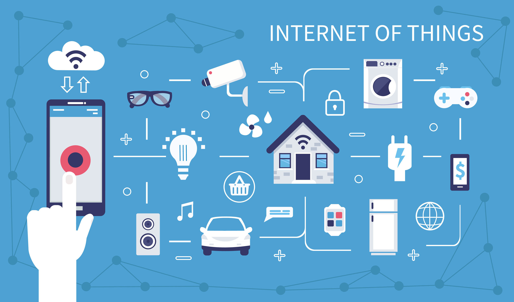
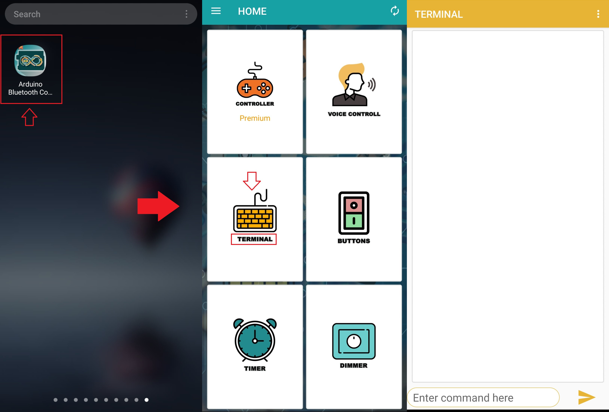

<h1 class="h1">Internet of Things (IoT )</h1>
<h2 class="h2">What is an Internet of Things (IoT)</h2>

Let's us look closely at our mobile device which contains GPS Tracking, Mobile Gyroscope, Adaptive brightness, Voice detection, Face detection etc. These components have their own individual features, but what about if these all communicate with each other to provide a better environment? For example, the phone brightness is adjusted based on my GPS location or my direction.

Connecting everyday things embedded with electronics, software, and sensors to Internet enabling to collect and exchange data without human interaction callight as the Internet of Things (IoT).

The term "Things" in the Internet of Things refers to anything and everything in day to day life which is accessed or connected through the internet.

[**Reference**](https://dmexco.com/stories/thats-why-the-internet-of-things-needs-artificial-intelligence/)

IoT is an advanced automation and analytics system which deals with artificial intelligence, sensor, networking, electronic, cloud messaging etc. to deliver complete systems for the product or services. The system created by IoT has greater transparency, control, and performance. 

As we have a platform such as a cloud that contains all the data through which we connect all the things around us. For example, a house, where we can connect our home appliances such as air conditioner, light, etc. through each other and all these things are managed at the same platform. Since we have a platform, we can connect our car, track its fuel meter, speed level, and also track the location of the car.

If there is a common platform where all these things can connect to each other would be great because based on my preference, I can set the room temperature. For example, if I love the room temperature to to be set at 25 or 26-degree Celsius when I reach back home from my office, then according to my car location, my AC would start before 10 minutes I arrive at home. This can be done through the Internet of Things (IoT).

<h2 class="h2">How does Internet of Thing (IoT) Work?</h2>

The working of IoT is different for different IoT echo system (architecture). However, the key concept of there working are similar. The entire working process of IoT starts with the device themselves, such as smartphones, digital watches, electronic appliances, which securely communicate with the IoT platform. The platforms collect and analyze the data from all multiple devices and platforms and transfer the most valuable data with applications to devices.

<h2 class="h2">Features of IOT</h2>

The most important features of IoT on which it works are connectivity, analyzing, integrating, active engagement, and many more. Some of them are listed below:

<strong>Connectivity:</strong> Connectivity refers to establish a proper connection between all the things of IoT to IoT platform it may be server or cloud. After connecting the IoT devices, it needs a high speed messaging between the devices and cloud to enable reliable, secure and bi-directional communication.

<strong>Analyzing:</strong> After connecting all the relevant things, it comes to real-time analyzing the data collected and use them to build effective business intelligence. If we have a good insight into data gathered from all these things, then we call our system has a smart system.

<strong>Integrating:</strong> IoT integrating the various models to improve the user experience as well. 

<strong>Artificial Intelligence:</strong> IoT makes things smart and enhances life through the use of data. For example, if we have a coffee machine whose beans have going to end, then the coffee machine itself order the coffee beans of your choice from the retailer.

<strong>Sensing:</strong> The sensor devices used in IoT technologies detect and measure any change in the environment and report on their status. IoT technology brings passive networks to active networks. Without sensors, there could not hold an effective or true IoT environment.

<strong>Active Engagement:</strong> IoT makes the connected technology, product, or services to active engagement between each other. 

<strong>Endpoint Management:</strong> It is important to be the endpoint management of all the IoT system otherwise, it makes the complete failure of the system. For example, if a coffee machine itself order the coffee beans when it goes to end but what happens when it orders the beans from a retailer and we are not present at home for a few days, it leads to the failure of the IoT system. So, there must be a need for endpoint management.

<strong>Here are the links for more detailed tutorials</strong>

<ul class="points">
<li><a href="iot-internet-of-things">IoT Tutorial</a></li>
<li><a href="iot-advantage-and-disadvantage">Advantage &amp; Disadvantage</a></li>
<li><a href="iot-embedded-devices">Embedded Devices and System</a></li>
<li><a href="iot-ecosystem">IoT Ecosystem</a></li>
<li><a href="iot-decision-framework">IoT Decision Framework</a></li>
</ul>

<strong>Architecture &amp; Domains</strong>

<ul class="points">
<li><a href="iot-architecture-models">Solution Architecture Models</a></li>
<li><a href="iot-energy-domain">IoT - Energy Domain</a></li>
<li><a href="iot-biometric-domain">IoT - Biometric Domain</a></li>
<li><a href="iot-security-camera-and-door-unlock-system">Security Camera and Door Unlock System</a></li>
<li><a href="iot-smart-home-and-smart-city">Smart Home and City</a></li>
<li><a href="iot-smart-agriculture-domain">IoT - Smart Agriculture</a></li>
<li><a href="iot-healthcare">IoT - Healthcare</a></li>
<li><a href="iot-transportation">IoT - Transportation</a></li>
<li><a href="iot-transforming-businesses">Transforming Businesses</a></li>
</ul>

<strong>IoT Devices</strong>

<ul class="points">
<li><a href="iot-smart-objects">Smarts Objects</a></li>
<li><a href="iot-devices">IoT Devices</a></li>
<li><a href="major-iot-boards-in-market">Major IoT Boards in Market</a></li>
</ul>

<strong>IoT Platforms</strong>

<ul class="points">
<li><a href="iot-platform">IoT Platform</a></li>
<li><a href="iot-thingworx-platform">ThingWorx Platform</a></li>
</ul>

<strong>Communication Protocols</strong>

<ul class="points">
<li><a href="iot-data-link-communication-protocol">Data Link</a></li>
<li><a href="iot-network-layer-protocols">Network Layer</a></li>
<li><a href="iot-session-layer-protocols">Session Layer</a></li>
</ul>

<strong>Assessment</strong>

<strong>Turning light on and off using NodeMCU ESP8266 with wifi and Bluetooth</strong>
  

 <strong>Materials</strong>
   
 ESP8266
   
 Breadboard
   
 Resistor
   
 Bluetooth Module
   
 Light Bulb
   
 Jumper Wires
   

 <strong>platforms</strong>
  
 IDE
   
 HTML
   
 JAVASCRIPT
   
 CSS
   

 Arduino Bluetooth Controller
   
   
 
 <strong>Libraries</strong>
   
     
  
 **Open Arduino IDE:**

Make sure you have the Arduino IDE installed on your computer. If not, download and install it from the official Arduino website: Arduino Software.

**Connect to the Internet:**

Ensure that your computer is connected to the internet, as the Arduino IDE will need to download the libraries from online repositories.

**Open Library Manager:**

In the Arduino IDE, go to "Sketch" in the menu bar.
Select "Include Library" and then click on "Manage Libraries."

**Browse or Search for Libraries:**

The Library Manager will open, allowing you to search for and install libraries.
You can browse the list or use the search bar to find the specific library you need for your IoT project.

**Select and Install the Library:**

Once you find the library you want, click on it to select it.
In the bottom right corner of the Library Manager window, you will see an "Install" button. Click it to start the installation process.

**Wait for Installation:**

The Arduino IDE will download and install the selected library. You will see a progress bar indicating the status of the installation.

**Library Installed:**

After the installation is complete, you will see a green checkmark next to the library's name, indicating that it has been installed successfully.

**Verify Installation:**

To verify that the library is installed correctly, you can go back to the Arduino IDE and check if the library is now available under "Sketch" > "Include Library." You should see the newly installed library listed there.

**Use the Library in Your Sketch:**

Once the library is installed, you can include it in your Arduino sketch. Use the #include directive at the beginning of your code to include the library.
  To do this assessment, we have added the following libraries.
   
    
   
 <strong>ESP8266 Libraries</strong>
     
     
   To add ESP8266, go to file, then preference. After that paste this link from nexmaker.
       http://arduino.esp8266.com/stable/package_esp8266com_index.json
        
        
   
   
    
   
    
    
  
 <strong>ESP8266WebServer</strong> 
   
   
  To add this library, go to GitHub, and write ESP8266WebServer on the search engine. 
   
    
  
   
   
  
   
   
   
 
 
  
<strong>SoftwareSerial</strong> 
   
    
  
     
     
  
    
    
  
 <strong>ESP8266WiFi</strong> 
   
    
  To add this library, the same as above mentioned, it is added by downloading from GitHub.
     
     
    
   
     
   

Before we start our actual assessment, Let&#39;s introduce the components we used. In recent years, the ESP8266 has emerged as a pivotal component in Internet of Things (IoT) and WiFi-related ventures. As a cost-effective WiFi module, the ESP8266 can be ingeniously programmed to operate as an autonomous web server, opening up a myriad of possibilities for innovative projects.

A web server, in essence, serves as a repository where web pages are stored, processed, and subsequently delivered to web clients. These clients, typically web browsers on computers and smartphones, engage in communication with web servers through the Hypertext Transfer Protocol (HTTP).

To elaborate, when a client initiates a conversation, it sends an HTTP request for a specific web page to the server. In turn, the server responds by furnishing the content of the requested web page or an error message, such as the well-known 404 Error if the page cannot be found.

The ESP8266 boasts the capability not only to connect to an existing WiFi network and function as a web server but also to establish its own network, allowing direct connectivity for other devices. This versatility arises from the ESP8266&#39;s ability to operate in three distinct modes: Station (STA) mode, Soft Access Point (AP) mode, or both simultaneously.

In Station (STA) mode, the ESP8266 seamlessly integrates with an existing WiFi network, obtaining an IP address from the router. This IP address facilitates the setup of a web server, enabling the ESP8266 to serve web pages to all connected devices on the established WiFi network.

On the other hand, in Access Point (AP) mode, the ESP8266 assumes the role of a hub, creating its own WiFi network and serving as a central point for one or more stations. This mode, Soft Access Point (soft-AP), imitates a WiFi router, though without a wired network interface. It can connect with up to five stations simultaneously, creating a new WiFi network with a designated SSID (network name) and IP address.

With a foundational understanding of web server fundamentals and the ESP8266&#39;s versatile operating modes, the next step involves practical application. For instance, Light to the ESP8266 allows for WiFi-based control.

To implement this, place the NodeMCU (a popular ESP8266 development board) on a breadboard, ensuring each side aligns with different sections of the board. Proceed to connect Light to digital GPIO pins D3, utilizing a 220Ω current-limiting resistor. This configuration sets the stage for controlling real light through WiFi.

The operational concept involves controlling connected devices by visiting specific URLs. When a IP address, is entered into a web browser, it triggers an HTTP request (GET request) to the ESP8266. The ESP8266 interprets the request, recognizes the user&#39;s intent to turn on the light, executes the action, and sends a dynamic webpage to the browser, reflecting the light&#39;s status as &quot;on.&quot;

To delve deeper into the implementation of an ESP8266 Web Server in Access Point (AP) mode and the provision of web pages to connected clients, the following project showcases the configuration of the ESP8266 Web Server in this specific mode. This demonstration elucidates the intricate yet accessible nature of deploying the ESP8266 for practical and interactive applications in the realm of IoT and WiFi-based projects.

 The web interface is implemented using the ESP8266WebServer library, which is part of the ESP8266 Arduino core. Here&#39;s overview of the working principle:

<strong>WiFi Connection:</strong>

<pre><code>WiFi.begin(ssid, password);
  
  // Wait for connection
  while (WiFi.status() != WL_CONNECTED) {
    delay(1000);
    Serial.print(&quot;.&quot;);
  }
</code></pre>

This part of the code connects the ESP8266 to the Wi-Fi network using the provided SSID and password. It waits until the connection is established.

<strong>Web Server Setup:</strong>

 
      ESP8266WebServer server(80);
 
The ESP8266WebServer instance is created, listening on port 80, which is the default port for HTTP.

 
  

<strong>Handling Requests</strong>

 

<pre><code>server.on(&quot;/&quot;, HTTP_GET, handleRoot);
  server.on(&quot;/on&quot;, HTTP_POST, { handleCommand(&quot;on&quot;); });
  server.on(&quot;/off&quot;, HTTP_POST, { handleCommand(&quot;off&quot;); });
  server.begin();
</code></pre>
 
The code sets up three routes: "/" for the root, "/on" for turning the light on, and "/off" for turning the light off. These routes are configured to execute specific functions when accessed.
  
 

<em>HTML Response</em>

 
 

<pre><code>void handleRoot() {
  String html = &quot;&lt;html&gt;&lt;head&gt;&lt;style&gt;&quot;;
  html += &quot;body { margin: 0; font-family: Arial, sans-serif; }&quot;;
  html += &quot;h1 { text-align: center; padding: 20px; background-color: #333; color: #fff; margin: 0; font-size: 60px; }&quot;;
  html += &quot;form { text-align: center; margin: 20px; }&quot;;
  html += &quot;input#on { padding: 10px; font-size: 50px; margin: 5px; background-color: red; color: white; }&quot;;
  html += &quot;input#off { padding: 10px; font-size: 50px; margin: 5px; background-color: black; color: white; }&quot;;
  html += &quot;&lt;/style&gt;&lt;/head&gt;&lt;body&gt;&quot;;
  html += &quot;&lt;h1&gt;Light Control&lt;/h1&gt;&quot;;
  html += &quot;&lt;form action=&#39;/on&#39; method=&#39;post&#39;&gt;&lt;input id=&#39;on&#39; type=&#39;submit&#39; value=&#39;Turn On Light&#39;&gt;&lt;/form&gt;&quot;;
  html += &quot;&lt;form action=&#39;/off&#39; method=&#39;post&#39;&gt;&lt;input id=&#39;off&#39; type=&#39;submit&#39; value=&#39;Turn Off Light&#39;&gt;&lt;/form&gt;&quot;;
  html += &quot;&lt;/body&gt;&lt;/html&gt;&quot;;
  server.send(200, &quot;text/html&quot;, html);
}
</code></pre>
 
The handleRoot function generates an HTML page with two buttons ("Turn On light" and "Turn Off light") and sends it as a response when the root ("/") route is accessed.
  
  
 

<strong>Form Submission</strong>

 
 
The two buttons are part of HTML forms. When a button is clicked, a POST request is sent to the corresponding route ("/on" or "/off").
  
  
 

<strong>Server-Side Handling</strong>

 

<pre><code>void handleCommand(String command) {
  

  server.sendHeader(&quot;Location&quot;, &quot;/&quot;);
  server.send(303);
}
</code></pre>
 
 
The handleCommand function is called when a POST request is received on the "/on" or "/off" route. It processes the command and controls the light accordingly.
  
  
 

<strong>Light Control</strong>

 
 
The light control is performed inside the handle command function:

 

<pre><code>if (command == &quot;on&quot;) {
      digitalWrite(LightPin, LOW); // code to turn on Light
    } else if (command == &quot;off&quot;) {
      digitalWrite(LightPin, HIGH); // code to turn off Light
    }
</code></pre>
 
Depending on the received command ("on" or "off"), the digital output pin connected to the light (D3) is set to HIGH or LOW.
  
  
 

<strong>Redirect and Response</strong>

 
After processing the command, a redirect response is sent back to the client:
 

<pre><code>server.sendHeader(&quot;Location&quot;, &quot;/&quot;);
server.send(303);
</code></pre>
 
This redirects the client to the root ("/") route, and the updated HTML page with the current light state is displayed.
  
  
  

<strong>Bluetooth Integration</strong>

 

<pre><code>if (bluetoothSerial.available() &gt; 0) {
    char command = bluetoothSerial.read();

    if (command == &#39;0&#39;) {
      digitalWrite(LightPin, HIGH); // Turn on Light
    } else if (command == &#39;1&#39;) {
      digitalWrite(LightPin, LOW); // Turn off Light
    }
  }
</code></pre>

This part of the code checks if there are incoming characters available from the Bluetooth serial connection (Bluetooth serial).
If the Wi-Fi is not working, the ESP8266 will still be able to receive Bluetooth commands and control the light accordingly.
  
  

We used Fritzing to connect the diagram.

 Download from [**Fritzing**](https://www.filehorse.com/download-fritzing-64/)
 
 
 
 Once installed, then open it.

Then Drag and drop.

 

 We drew our circuit diagram as follows.
 

Electrical designing can be automated with the tool. You can use it to develop circuit board diagrams and to use a virtual test board for mounting prototypes. And if you want to do a [**PCB building**](https://www.filehorse.com/download-proteus-pcb-design/), you can select the necessary circuit routing for it.

**Fritzing** is an open-source software that enables users to design, document, and share their electronic circuits. It provides an intuitive and beginner-friendly interface that simplifies the process of creating electronic projects, from simple breadboard layouts to complex [**PCB designs**](https://www.filehorse.com/download-expresspcb/). It combines schematic capture, breadboard view, and PCB layout into a single integrated tool, making it an ideal choice for users with varying levels of expertise.

  

This is the best tool to use for either professional or educational purposes. Anyone involved in electronics can benefit from this tool, such as engineers, electronics enthusiasts, and teachers.

  

**Plenty of Features to Create a Prototype of Your Own**

  

**Fritzing 64-bit** has several options and features available. It lets you develop a virtual test board, utilize an auto-router in automatic mode or manual mode, and create a circuit diagram. As you are designing, you can add notes which are sharable with other users. Several components can be used too. There is an online project gallery that is accessible to see the work.

  

**The interface of the tool has three accessible views available for starting a new project. They are as follows:**

*   **Protoboard View** – Gives the test board view, so you can sketch the way you want the components to connect on the real board.
*   **Schematic View** – Uses symbols to represent the connections and components.
*   **Printed Circuit Board** – Lets you preview the way components get distributed on a PCB. Here you select the positioning and connections that are best for the components.

It is free to download this tool and educate yourself on electronics. You can do this on your personal computer at home. **Fritzing** 0.9.10 version is a commercialware paid version.

  

**Features**

  

**Breadboard View**: It offers a virtual breadboard where users can place and connect electronic components to simulate their circuit designs. This feature allows users to quickly test their ideas before moving to the PCB layout phase.

  

**Schematic Editor**: The software provides a powerful schematic editor that enables users to create circuit diagrams using a vast library of components. This feature allows for precise and organized circuit documentation.

  

**PCB Design**: The app allows users to convert their breadboard designs into professional-looking PCB layouts. It offers features such as auto-routing, copper pour, and design rule checking to ensure the integrity of the final design.

  

**Parts Library**: It includes an extensive library of electronic components, ranging from resistors and capacitors to microcontrollers and sensors. The library is regularly updated and allows users to contribute their components, fostering a collaborative community.

  

**Project Sharing**: It provides a platform for users to share their projects with the community. This feature encourages collaboration, enables others to learn from existing designs, and promotes innovation.

  

**User Interface**

  

The app boasts a clean and intuitive user interface, designed to cater to both beginners and experienced users. The main workspace is divided into three sections: breadboard, schematic, and PCB views. Users can seamlessly switch between these views and observe the changes in real time. The toolbar offers quick access to frequently used tools, while the sidebar provides access to the parts library and project information.

  

**Installation and Setup**

  

Installing **Fritzing** is a straightforward process. The software is available for Windows, macOS, and Linux platforms. Users can download the installation package from the official website and follow the step-by-step instructions to complete the installation. It also provides comprehensive documentation to guide users through the setup process, ensuring a smooth experience.

  

**How to Use**

  

**Creating a New Project**: Upon launching the app, users can start a new project by selecting the desired project type (breadboard, schematic, or PCB). They can then begin by adding components from the library to the workspace.

  

**Designing the Circuit**: Users can drag and drop components onto the breadboard view, making the necessary connections. They can then switch to the schematic view to create a circuit diagram and validate their design.

  

**PCB Layout**: Once satisfied with the circuit design, users can convert it to a PCB layout by selecting the appropriate option. Fritzing offers various tools to assist in arranging components, routing traces, and generating manufacturing files.

  

**Project Sharing**: Users can share their completed projects on the community platform. They can export their designs in various formats, such as PDF, SVG, and Gerber, making it easy to showcase and collaborate on projects.
  

<strong>Wifi case</strong>

 

 
  
 <video width=100% height=56.25% controls><source src="image/iots.mp4" type="video/mp4">
</video>

Integrating Bluetooth functionality into the system is crucial for providing a reliable and alternative means of controlling the light when the Wi-Fi connection is down. Here's why it's important:
  
  
 

<strong>Redundancy and Reliability</strong>

 
By incorporating Bluetooth, the system gains redundancy in communication methods. In the event of a Wi-Fi connection failure, Bluetooth serves as a reliable backup, ensuring continuous control over the light.
  
 

<strong>Uninterrupted Operation</strong>

Users can still manage and control the light even if the primary Wi-Fi network is unavailable. This is especially important for critical applications where uninterrupted operation is essential.
  

<strong>User Convenience</strong>

Bluetooth integration enhances user convenience by allowing seamless control through a secondary interface. Users don&#39;t need to rely solely on the web interface and can switch to Bluetooth effortlessly when needed.
  

<strong>Fallback Mechanism</strong>

The system gracefully falls back to Bluetooth control when Wi-Fi connectivity is lost. This fallback mechanism prevents a complete loss of functionality and maintains user access to essential features.
 &lt;br

<strong>Enhanced User Experience</strong>

Users may not even notice a connectivity issue when controlling the light via Bluetooth. The system redirects web interface users to the root page, providing a consistent and user-friendly experience.
  

<strong>Versatility Across Environments</strong>

In scenarios where Wi-Fi signals are unreliable or when deploying the system in environments with intermittent connectivity, Bluetooth support ensures the system remains operational.
  

<strong>Extended Use Cases</strong>

Bluetooth integration opens up new use cases, such as controlling the light from a mobile app or a Bluetooth-enlight device, offering flexibility beyond traditional web-based control.

In conclusion, integrating Bluetooth capability ensures the robustness and continuity of the system, allowing users to maintain control over the light even during Wi-Fi downtimes. This enhances overall system reliability, user satisfaction, and versatility across different operational scenarios.
  

<strong>Bluetooth case</strong>

First, download the Arduino Bluetooth Controller from the app store. Then open it and click terminal as follows. Finally, Write a command to control the light

Here is the Demo
 
  
<video width="100%" height="360" controls>
    <source src="image/bl.mp4" type="video/mp4">
    Your browser does not support the video tag.
</video>
  
  
Here is the code

<pre><code>#include &lt;ESP8266WiFi.h&gt;
#include &lt;ESP8266WebServer.h&gt;
#include &lt;SoftwareSerial.h&gt;

const char* ssid = &quot;Your wifi name&quot;;
const char* password = &quot; your wifi password&quot;;

ESP8266WebServer server(80);
SoftwareSerial bluetoothSerial(D6, D7); // RX, TX

const int LightPin = D3; // Pin to which the Light is connected

void setupBluetooth() {
  bluetoothSerial.begin(9600);
}
void setup() {
  Serial.begin(9600);
  setupBluetooth();

  // Connect to Wi-Fi
  WiFi.begin(ssid, password);
  
  // Wait for connection
  while (WiFi.status() != WL_CONNECTED) {
    delay(1000);
    Serial.print(&quot;.&quot;);
  }

  // Print the IP address
  Serial.println();
  Serial.print(&quot;Connected to &quot;);
  Serial.println(ssid);
  Serial.print(&quot;IP address: &quot;);
  Serial.println(WiFi.localIP());

  pinMode(LightPin, OUTPUT);

  // Set up server routes
  server.on(&quot;/&quot;, HTTP_GET, handleRoot);
  server.on(&quot;/on&quot;, HTTP_POST, { handleCommand(&quot;on&quot;); });
  server.on(&quot;/off&quot;, HTTP_POST, { handleCommand(&quot;off&quot;); });
  server.begin();
}

void loop() {
  server.handleClient();

  if (bluetoothSerial.available() &gt; 0) {
    char command = bluetoothSerial.read();

    if (command == &#39;0&#39;) {
      digitalWrite(LightPin, HIGH); // Turn on Light
    } else if (command == &#39;1&#39;) {
      digitalWrite(LightPin, LOW); // Turn off Light
    }
  }
}

void handleRoot() {
  String html = &quot;&lt;html&gt;&lt;head&gt;&lt;style&gt;&quot;;
  html += &quot;body { margin: 0; font-family: Arial, sans-serif; }&quot;;
  html += &quot;h1 { text-align: center; padding: 20px; background-color: #333; color: #fff; margin: 0; font-size: 60px; }&quot;;
  html += &quot;form { text-align: center; margin: 20px; }&quot;;
  html += &quot;input#on { padding: 10px; font-size: 50px; margin: 5px; background-color: red; color: white; }&quot;;
  html += &quot;input#off { padding: 10px; font-size: 50px; margin: 5px; background-color: black; color: white; }&quot;;
  html += &quot;&lt;/style&gt;&lt;/head&gt;&lt;body&gt;&quot;;
  html += &quot;&lt;h1&gt;Light Control&lt;/h1&gt;&quot;;
  html += &quot;&lt;form action=&#39;/on&#39; method=&#39;post&#39;&gt;&lt;input id=&#39;on&#39; type=&#39;submit&#39; value=&#39;Turn On Light&#39;&gt;&lt;/form&gt;&quot;;
  html += &quot;&lt;form action=&#39;/off&#39; method=&#39;post&#39;&gt;&lt;input id=&#39;off&#39; type=&#39;submit&#39; value=&#39;Turn Off Light&#39;&gt;&lt;/form&gt;&quot;;
  html += &quot;&lt;/body&gt;&lt;/html&gt;&quot;;
  server.send(200, &quot;text/html&quot;, html);
}

void handleCommand(String command) {
  if (command == &quot;on&quot;) {
    digitalWrite(LightPin, LOW); // Turn on Light
  } else if (command == &quot;off&quot;) {
    digitalWrite(LightPin, HIGH); // Turn off Light
  }

  server.sendHeader(&quot;Location&quot;, &quot;/&quot;);
  server.send(303);
}
</code></pre>

<strong>Thingspeak</strong>

<a href="https://thingspeak.com/">Official Website</a>
  
ThingSpeak is an Internet of Things (IoT) platform that enables users to collect, analyze, visualize, and act on data from IoT devices. It provides an easy-to-use interface for managing and analyzing data streams, making it a popular choice for IoT applications.
First log in to the official website.
To create your channel, Click on channel.

 Here are some of the applications.
   

<strong>Private View:</strong>

Overview: In ThingSpeak, a private view refers to the ability to configure your channel&#39;s visibility. Private views restrict access to the channel&#39;s data, requiring authentication for users to view or interact with it.
Channel Privacy: Users can set a channel to be private, making it accessible only to those with the appropriate API key. This adds a layer of security, preventing unauthorized access to sensitive data.
Limited Visibility: Private views ensure that the channel&#39;s data is not publicly accessible without the necessary credentials.
  

<strong>Public View:</strong>

Overview: Public views in ThingSpeak allow users to share their channel&#39;s data with a wider audience. This is useful for scenarios where open access to data is desired.
Public Channel: When a channel is set to public, its data is accessible without authentication. This is suitable for cases where the information is intended for a broader audience.
Sharing URL: ThingSpeak provides a public URL for public channels, allowing users to easily share and embed their data visualizations.

  

<strong>Channel Settings:</strong>

  
Overview: Channel settings in ThingSpeak provide users with control over various configurations related to their data channels.
Field Configuration: Users can define and customize fields within a channel, specifying the type of data they will store (e.g., temperature, humidity).
Timezone Settings: Channels can be configured to display data in a specific timezone, ensuring accurate timestamp representation.
Metadata: Additional information, such as channel descriptions, can be added to provide context for collaborators and viewers.
  
  

<strong>Sharing:</strong>

Overview: ThingSpeak facilitates collaboration by allowing users to share access to their channels with others.
Collaborative Access: Users can add collaborators to their channels, specifying whether collaborators have read-only or read-write access.
Access Control: Sharing is done through email invitations, and collaborators need a ThingSpeak account to access the shared channel.

<strong>API Keys:</strong>

Overview: API keys in ThingSpeak are essential for authentication and authorization when interacting with channels programmatically.
Creation: Users can generate API keys associated with their accounts. Different keys may have different permissions (e.g., read-only, read-write).
Secure Interaction: API keys ensure that only authorized applications or devices can read from or write to a channel.

  

<strong>Data Import / Export:</strong>

Overview: ThingSpeak supports versatile methods for importing and exporting data to and from channels.
Data Import: Users can send data to their channels using protocols like HTTP, MQTT, or ThingSpeak&#39;s REST API. This is typically done by IoT devices or sensors.
Data Export: Reading data from ThingSpeak channels can be done using the Read API. Additionally, MATLAB analysis allows users to perform advanced computations within the platform.
Integration: ThingSpeak integrates with other platforms and services, allowing users to export data for further analysis or visualization.

Here is the Arduino code

<pre><code>#include &lt;ESP8266WiFi.h&gt;

String apiKey = &quot;677C1G8GRK58UT1V&quot;; // write your &quot;Write API key&quot;
const char* ssid = &quot;&quot;; // write your &quot;wifi name&quot;
const char* password = &quot;&quot;; // write your &quot;wifi password&quot;
const char* server = &quot;api.thingspeak.com&quot;;
WiFiClient client;

//for NodeMCU
const int trigPin = D6;
const int echoPin = D7;
// defines variables
long duration;
int distance;

void setup() 
{
  Serial.begin(9600);
  Serial.println(&quot;Serial Begin&quot;);
  pinMode(trigPin, OUTPUT); 
  pinMode(echoPin, INPUT); 
  WiFi.begin(ssid, password);
  Serial.println();
  Serial.print(&quot;Connecting to &quot;);
  Serial.println(ssid);
        
  while (WiFi.status() != WL_CONNECTED)
  {
    delay(500);
    Serial.print(&quot;.&quot;);
  }
    Serial.println(&quot;&quot;);
    Serial.println(&quot;WiFi connected&quot;);
}

void loop() 
{
  ultra();
  delay(1000);
    if (client.connect(server,80))
    {
      fwd_to_Thingspeak();
    }
    client.stop();
    Serial.println(&quot;Waiting&quot;);
    delay(1000);
}

void ultra()
{
  // Clears the trigPin
  digitalWrite(trigPin, LOW);
  delayMicroseconds(2);
  digitalWrite(trigPin, HIGH);
  delayMicroseconds(10);
  digitalWrite(trigPin, LOW);
  
  duration = pulseIn(echoPin, HIGH) ;
  distance= duration*0.034/2;
  Serial.println(&quot;Distance =&quot; + String(distance) + &quot; cm&quot;);
}

void fwd_to_Thingspeak()
{
  String postStr = apiKey;
  postStr +=&quot;&amp;field1=&quot;;
  postStr += String(distance);  // ultrasonic data
  postStr += &quot;\r\n\r\n&quot;;
          
  client.print(&quot;POST /update HTTP/1.1\n&quot;);
  client.print(&quot;Host: api.thingspeak.com\n&quot;);
  client.print(&quot;Connection: close\n&quot;);
  client.print(&quot;X-THINGSPEAKAPIKEY: &quot;+apiKey+&quot;\n&quot;);
  client.print(&quot;Content-Type: application/x-www-form-urlencoded\n&quot;);
  client.print(&quot;Content-Length: &quot;);
  client.print(postStr.length());
  client.print(&quot;\n\n&quot;);
  client.print(postStr);
          
  Serial.println(&quot;Send data to thingspeak: &quot;);
  Serial.print(&quot;Content-Length: &quot;);
  Serial.print(postStr.length());
  Serial.print(&quot; Field-1: &quot;);
  Serial.print(distance);  // ultrasonic data
  Serial.println(&quot; data send&quot;);            
}
</code></pre>

<a href="https://github.com/itsbhupendrasingh/Distance-Measurement-Ultrasonic-Thingspeak">Source</a>
  

Demo in Arduino serial monitor and Thingspeak

<video width=100% height=56.25% controls>
  <source src="Videos/iot video.mp4" type="video/mp4">
</video>

<video width=100% height=56.25% controls>
  <source src="Videos/thsd.mp4" type="video/mp4">
</video>

 

<strong>References</strong>

<a href="https://www.nexmaker.com/doc/10IOT/NodeMCUESP8266_ALiYun.html">Nexmaker</a>
  

<a href="https://www.javatpoint.com/iot-internet-of-things">JavaTpoints</a>

